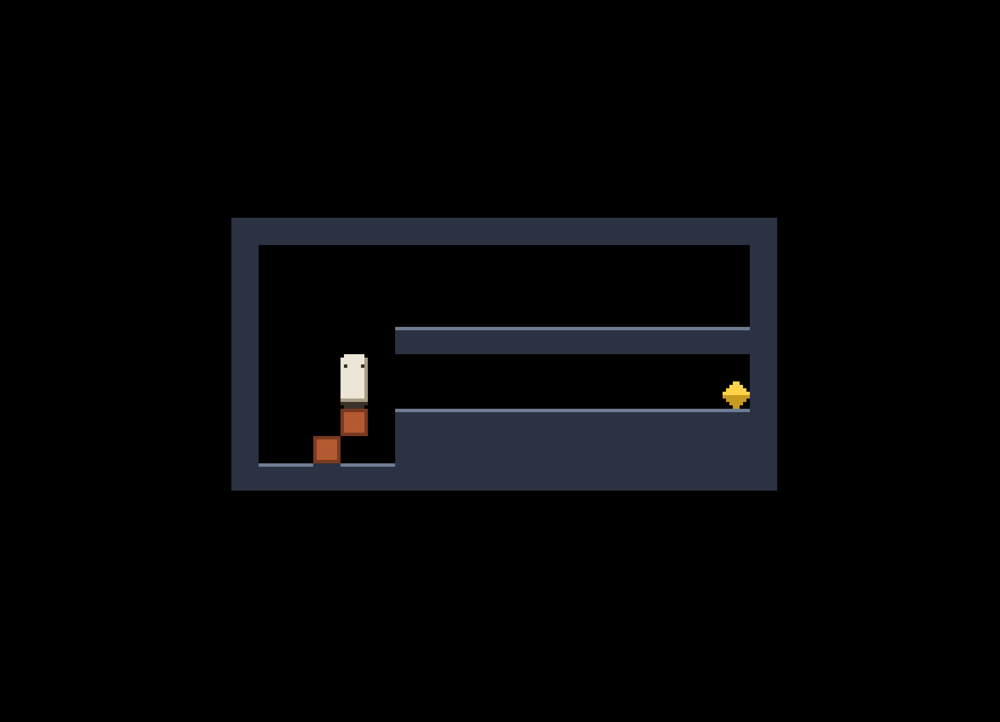

# CubeP

Author: Haoran Xie

Design: CubeP is a puzzle platformer where you play as a stack of blocks and
you platform by dropping blocks of yourself. 

Screen Shot:

How Your Asset Pipeline Works:

Input takes a 32x16 `assets/tiles.png` which represents eight 8x8 tiles in a 4x2 grid.
PPU466 only allows four colors, so no 8x8 cell can use more than four
counting transparent. `assets/tiles.txt` allows you to assign names to each tile
from left to right, and `assets/levels.txt` contains each level. 
Each level is represented with `.` empty, `#` wall, `P` start, `E` exit.

`pack-assets.cpp` reads those three and writes `dist/assets.chunk` by:

1. Cut each 8x8 cell out of the png and list the colors it uses.
2. Pick which of the PPU's eight palettes that cell will use. If one of them
   already holds all its colors, use that one. If not, but some palette still
   has empty slots and the missing colors fit, add them there. Otherwise start a
   new palette. If all eight are full and the cell still does not fit, stop and
   say which tile it was.
3. Write the cell out as the two bit planes the PPU stores tiles as, which means
   splitting each pixel's color index into a low bit and a high bit.
4. Turn each room upside down, since the PPU counts rows from the bottom and
   write them top-down. Check that every row is the same width, the room fits on
   screen, and it has one start and at least one exit.

The chunk file uses `read_write_chunk.hpp` from the base code. Names and rooms
are variable length, so the characters and cells each go in one flat array and
the records store begin/end indices based on the asset pipeline lesson. 
`Assets.cpp` rechecks those ranges on load and throws if any is bad, and
a `Load<Assets>` runs it at startup so a broken file never reaches a level.

`node Maekfile.js` builds the packer alongside the game. After that, run
dist/pack-assets whenever anything in `assets/` changes. I run it by hand and
commit `dist/assets.chunk`, so building the game never depends on it.

Files I drew: [assets/tiles.png](assets/tiles.png), with rooms in
[assets/levels.txt](assets/levels.txt) and names in
[assets/tiles.txt](assets/tiles.txt).

How To Play:

Left and Right walk, and walking into a one-tile step climbs it. Down drops your
lowest block in front of you, where it stays as solid ground. You get shorter
and cannot pick it back up. You cannot drop your last block. R restarts the room.

Reach an exit for the next room. There are four levels, and clearing the last one
shows an ending screen. Press R to start over. Moves happen on keypresses rather
than over time, so frame rate does not change what they do.

This game was built with [NEST](NEST.md).
